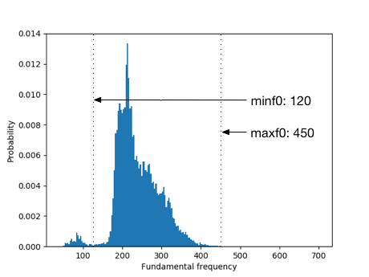
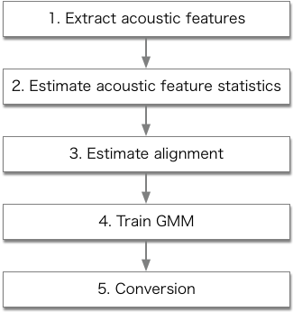

# Getting start with VC example
After installation finished, you can easily try voice conversion (VC) example scripts in "/sprocket/example"

```
cd example
```

## Download dataset from Voice Conversion Challenge 2016 (VCC2016)
In this example, you first prepare parallel speech dataset of source and target speaker in the "data/wav" directory.
In this tutorial, you can download VCC2016 speech database by executing following command.

```
python download_vcc2016dataset.py
```

Now, you can find .wav files in "data/wav" in each speaker.

## Initialization
For the initializations, you need to perform following 3 steps.

1. Prepare lists for training and evaluation in each source and target speaker
2. Prepare configure files of the source and target speaker and speaker-pair
3. Modify the range for F0 extraction 

### 1. Prepare training and evaluation lists
To create lists of source speaker (e.g., "SM1") and target speaker (e.g., "TF1"), run following command in example directory

```
python initialize.py -1 SM1 TF1 16000
```
where 16000 is a sampling rate of .wav file.
"-1" option indicates a flag to generate training and evaluation lists of source and target speakers.

You can change the number of speech samples to be used in the training and evaluation by editing the lists in "/list".
In this example, we make lists shorter by manually modification
We change the number of training speech samples to 30 and the number of evaluation speech samples to 10 as below.

list/SF1_train.list: 

``` 
SF1/100001
SF1/100002
SF1/100003
SF1/100004
SF1/100005
SF1/100006
SF1/100007
SF1/100008
SF1/100009
SF1/100010
SF1/100011
SF1/100012
SF1/100013
SF1/100014
SF1/100015
SF1/100016
SF1/100017
SF1/100018
SF1/100019
SF1/100020
SF1/100021
SF1/100022
SF1/100023
SF1/100024
SF1/100025
SF1/100026
SF1/100027
SF1/100028
SF1/100029
SF1/100030
```
list/SF1_eval.list: 

```
SF1/100031
SF1/100032
SF1/100033
SF1/100034
SF1/100035
SF1/100036
SF1/100037
SF1/100038
SF1/100039
SF1/100040
```

list/TF1_train.list:

``` 
TF1/100001
TF1/100002
TF1/100003
TF1/100004
TF1/100005
TF1/100006
TF1/100007
TF1/100008
TF1/100009
TF1/100010
TF1/100011
TF1/100012
TF1/100013
TF1/100014
TF1/100015
TF1/100016
TF1/100017
TF1/100018
TF1/100019
TF1/100020
TF1/100021
TF1/100022
TF1/100023
TF1/100024
TF1/100025
TF1/100026
TF1/100027
TF1/100028
TF1/100029
TF1/100030
```

list/TF1_eval.list:

``` 
TF1/100031
TF1/100032
TF1/100033
TF1/100034
TF1/100035
TF1/100036
TF1/100037
TF1/100038
TF1/100039
TF1/100040
```
Note that you have to coincidence the length and order of the lists between the source and target speakers.

### 2. Generate configure files
Next, to generate configure files of speakers, run following command.

```
python initialize.py -2 SF1 TF1 16000
```
where "-2" option indicates a flag to generate configure files for source and target speakers.
By executing this scripts, speaker-dependent YAML file (e.g., conf/speaker/SF1.yml) and speaker-pair dependent YAML file (e.g., conf/pair/SF1-TF1.yml) are generated. 

### 3. Modify F0 extraction range
In order to achieve better sound quality and conversion accuracy of the converted voice, it is necessary to designate appropriate parameters. 
In this step, we describe about how to define the F0 ranges.
First you run following command to generated F0 histograms.

```
python initialize.py -3 SF1 TF1 16000
```
where "-3" option indicates a flag to generate F0 histograms of the source and target speakers.
After finishing this commands, you can find the histograms in "conf/figure" directory.
Here is a example figure in "conf/figure/SF1_f0histogram.png".



Based on this figure, you manually modify "minf0" and "maxf0" in speaker-dependent YAML file (e.g., conf/speaker/TF1.yml) in each speaker.

## Run VC
Now you can perform VC using "run_sprocket.py"

```
python run_sprocket.py -1 -2 -3 -4 -5 SF1 TF1
```
This command perform based on following figure step by step.




## Run DIFFVC
If you want to perform DIFFVC with F0 transformation, you need to perform F0 transformation of speech samples of source speaker.
To perform F0 transformation, you run following command

```
python run_f0_transformation.py SF1 TF1
```
After command finished, you can find F0 transformed wav files in "data/wav" directory.
Using this wav file as a new source speaker, you can perform DIFFVC with F0 transformation.
Note that you need to perform initialization and run VC steps for F0 transformed source speaker and target speaker again.
